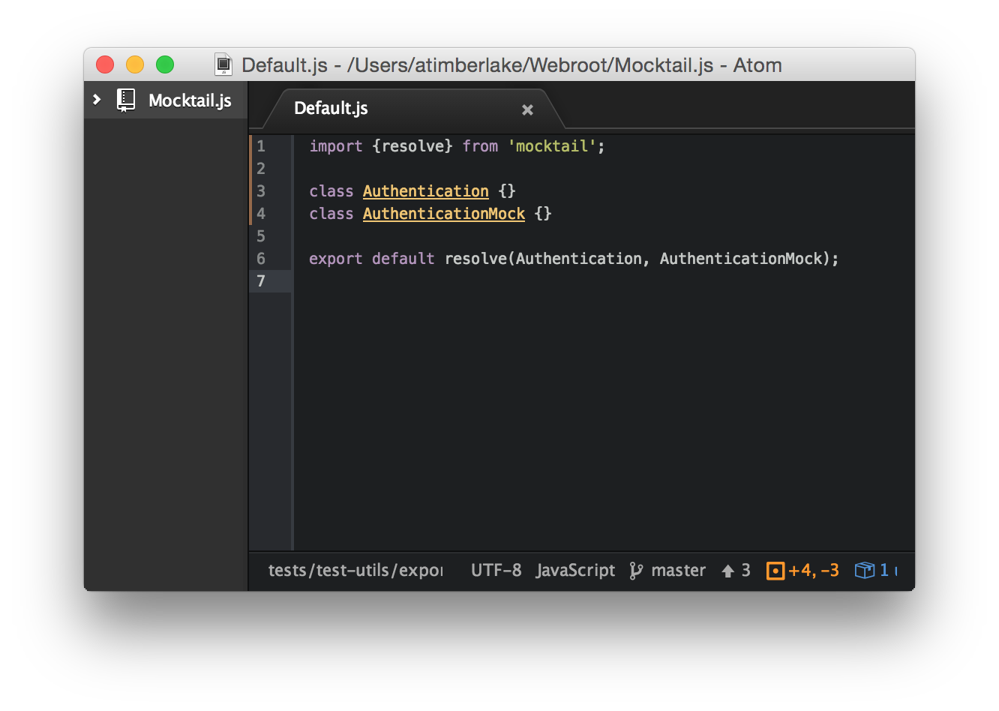

Mock all of your ES6 module components with Mocktail using dependency injection.


&nbsp;

&nbsp;


* **npm:** `npm i mocktail -D`



---

## Getting Started

Mocktail encourages developers to mock at runtime &mdash; dependency injection &mdash; when writing their tests &ndash; for this `mocktail` provides the `resolve` method.

```javascript
import {resolve} from 'mocktail';
class Request {}
export default resolve(Request);
```

By default the `resolve` method in the case above will return the actual `Request` object when imported. However, when unit testing you'll define the environment as `ENV.TESTING` using the `env` method in your bootstrap file:

> Bootstrap.js:
```javascript
import {env, ENV, inject} from 'mocktail';
env(ENV.TESTING);
// ...
```

In the same file you can specify an alternative for the `Request` object by specifying its `RequestMock` instead:

> Bootstrap.js:
```javascript
// ...
inject('Request', RequestMock);
```

**Note:** The `Request` name is specified as a `string` to the `inject` method, which is deduced from the actual `Request` object using its `name` property: `Request.name`.

Now whenever you import the `Request` module in your unit tests &mdash; assuming you import **after** you have imported your bootstrap file &mdash; then the returned object will be `RequestMock` rather than `Request`.

> MyTests.test.js
```javascript
import 'Bootstrap';
import Request from 'Request';
// ...
```

### Mocking Inline

Seldom you may wish to mock in your module itself &ndash; in these cases pass it through `mocktail.mock` passing in both the actual object and its associated mock object:

```javascript
import {mock} from 'mocktail';

class Request {}
class RequestMock {}

export default mock(Request, RequestMock);
```

With the `mock` method, the second argument is **always** the mocked object that will be returned when `environment` is defined as `true` using:

```javascript
import {env, ENV} from 'mocktail';
env(ENV.TESTING);
// ...
```

In the above example the default value for `environment` is `ENV.PRODUCTION` and can be set explicitly with: `env(ENV.PRODUCTION)`.

With Mocktail it's important to note that the `import` syntax is **exactly** the same whether you're importing the actual object or its mocked counterpart.

### Named Export

Often you may want to export your modules without exporting as the `default` &ndash; in these instances you can use the `export as` syntax:

```javascript
import {resolve} from 'mocktail';

class Request {}
class RequestMock {}

const Module = resolve(Request, RequestMock);
export {Module as Request};
```

Then when you import the module elsewhere, you simply refer to the import as `Request`, which could either be the true `Request` object, or its mock &ndash; `RequestMock`:

```javascript
import {Request} from './Request';
// ...
```

## Configuration

Setting up Mocktail is straightforward &ndash; with the easiest way being to have a bootstrap file that is loaded before your unit tests are run.

> Bootstrap.js:
```javascript
import {env, ENV} from 'mocktail';
env(ENV.TESTING);
```

You then need to ensure that your bootstrap file is loaded prior to the loading of your components:

```javascript
import './Bootstrap';
import Request from '../components/Request';

describe('Request', () => {
    // ...
});
```

Any time the `Request` component is imported, it will be the mocked counterpart as opposed to the actual object &ndash; which in the case of `Request` objects would simply mimic an AJAX call using a delay.

You can take a look in the [`example` directory](https://github.com/Wildhoney/Mocktail/blob/master/example) for the recommended setup for Mocktail.

## Dependency Injection

Another feature of Mocktail is the ability to inject an entirely custom module at runtime. Currently this feature only supports **named** functions and classes, and their names must be unique to your project otherwise you may be mocking a function with a shared name.

In your bootstrap you simply need to specify the name of the function you want to mock:

> Bootstrap.js
```javascript
import {env, inject, ENV} from 'mocktail';
env(ENV.TESTING);
class RequestMock {};
inject('Request', RequestMock);
```

And then within your `Request` module you would simply need to pass it through the `resolve` method with an *optional* second argument for the mocked function which will be used as a default:

```javascript
import {resolve} from 'mocktail';
class Request {};
export default resolve(Request);
```

Then whenever you reference `Request` in your unit tests, you'll receive `RequestMock` instead as long as you've set the `env` as `ENV.TESTING`.

## Contribute

[Pull requests](https://github.com/Wildhoney/Mocktail/pulls) are **highly** encouraged if you find any bugs, or wish to improve the codebase with wonderful ideas. However, if you're a little shy, please feel free to [open an issue](https://github.com/Wildhoney/Mocktail/issues) &ndash; that is fine, too.

Tests are written in Karma and can be run with `npm run test` after you have installed all dependencies with `npm i`.
