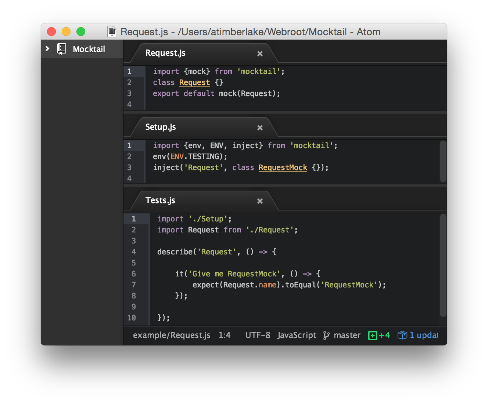

Mock all of your ES6 module components with Mocktail using dependency injection.


&nbsp;

&nbsp;


* **npm:** `npm i mocktail -D`



---

## Getting Started

> :ice_cream: Watch "Getting Started with Mocktail": https://vimeo.com/137495637

Mocktail encourages developers to stub at runtime &mdash; dependency injection &mdash; when writing their tests &ndash; for this `mocktail` provides the `mock` method.

> Request.js

```javascript
import {mock} from 'mocktail';

class Request {}

export default mock(Request);
```

By default the `mock` method in the case above will return the actual `Request` object when imported. However, when unit testing you'll define the environment as `ENV.TESTING` using the `env` method in your setup file. In the same file you can specify an alternative for the `Request` object by specifying its `RequestMock` instead:

> Setup.js

```javascript
import {env, ENV, inject} from 'mocktail';
env(ENV.TESTING);

inject('Request', RequestMock);
```

**Note:** The `Request` name is specified as a `string` to the `inject` method, which is deduced from the actual `Request` object using its `name` property: `Request.name`.

Now whenever you import the `Request` module in your unit tests &mdash; assuming you import **after** you have imported your setup file &mdash; then the returned object will be `RequestMock` rather than `Request`.

> Tests.js

```javascript
import 'Setup';
import Request from 'Request';
```

### Stubbing

Seldom you may wish to stub in your module itself &ndash; in these cases pass it through `mocktail.stub` passing in both the actual object and its associated stub object:

> Request.js

```javascript
import {stub} from 'mocktail';

class Request {}
class RequestMock {}

export default stub(Request, RequestMock);
```

With the `stub` method, the second argument is **always** the stubed object that will be returned when `environment` is defined as `true` using:

> Setup.js

```javascript
import {env, ENV} from 'mocktail';
env(ENV.TESTING);
```

In the above example the default value for `environment` is `ENV.PRODUCTION` and can be set explicitly with: `env(ENV.PRODUCTION)`.

With Mocktail it's important to note that the `import` syntax is **exactly** the same whether you're importing the actual object or its stubed counterpart.

### Named Export

Often you may want to export your modules without exporting as the `default` &ndash; in these instances you can use the `export as` syntax:

> Request.js

```javascript
import {mock} from 'mocktail';

class Request {}
class RequestMock {}

const Module = mock(Request, RequestMock);
export {Module as Request};
```

Then when you import the module elsewhere, you simply refer to the import as `Request`, which could either be the true `Request` object, or its stub &ndash; `RequestMock`:

> Tests.js

```javascript
import {Request} from './Request';
```

## Configuration

Setting up Mocktail is straightforward &ndash; with the easiest way being to have a setup file that is loaded before your unit tests are run.

> Setup.js

```javascript
import {env, ENV} from 'mocktail';
env(ENV.TESTING);
```

You then need to ensure that your setup file is loaded prior to the loading of your components:

> Tests.js

```javascript
import './Setup';
import Request from '../components/Request';

describe('Request', () => {
    it('Should provide RequestMock', () => {
        expect(Request.name).toEqual('RequestMock');
    });
});
```

Any time the `Request` component is imported, it will be the stubed counterpart as opposed to the actual object &ndash; which in the case of `Request` objects would simply mimic an AJAX call using a delay.

You can take a look in the [`example` directory](https://github.com/Wildhoney/Mocktail/blob/master/example) for the recommended setup for Mocktail.

## Comparing Proxyquire

**Note:** [See Discussion](https://github.com/Wildhoney/Mocktail/issues/2).

[Proxyquire](https://github.com/thlorenz/proxyquire) is a useful tool in importing mocks for your tests &ndash; so much so that it may seem futile to use `Mocktail`. However, the advantages of `Mocktail` are apparent when you consider a project.

Assume you have the following project:

> Request.js

```javascript
export default class Request() {}
```

> Flickr.js

```javascript
import Request from './Request';
```

With the `proxyquire` approach the `Flickr.js` file would still be holding the **actual** `Request` object that makes live AJAX requests &ndash; when testing this would be undesirable. Therefore with the `Mocktail` approach, `Flickr.js` would instead be holding a `RequestMock` object that simply waits for an arbitrary amount of time and then either resolves or rejects the promise &ndash; and *this* is the crucial difference between the two approaches.

If you wanted to make `proxyquire` behave as `Mocktail` does, then your `Flickr.js` file would need to `proxyquire` the `Request` object as well, which leads to polluting your code with test-specific code &ndash; with `Mocktail` the test-specific code is isolated to only the files you wish to mock and/or stub.

## Contribute

[Pull requests](https://github.com/Wildhoney/Mocktail/pulls) are **highly** encouraged if you find any bugs, or wish to improve the codebase with wonderful ideas. However, if you're a little shy, please feel free to [open an issue](https://github.com/Wildhoney/Mocktail/issues) &ndash; that is fine, too.

Tests are written in Karma and can be run with `npm run test` after you have installed all dependencies with `npm i`.
